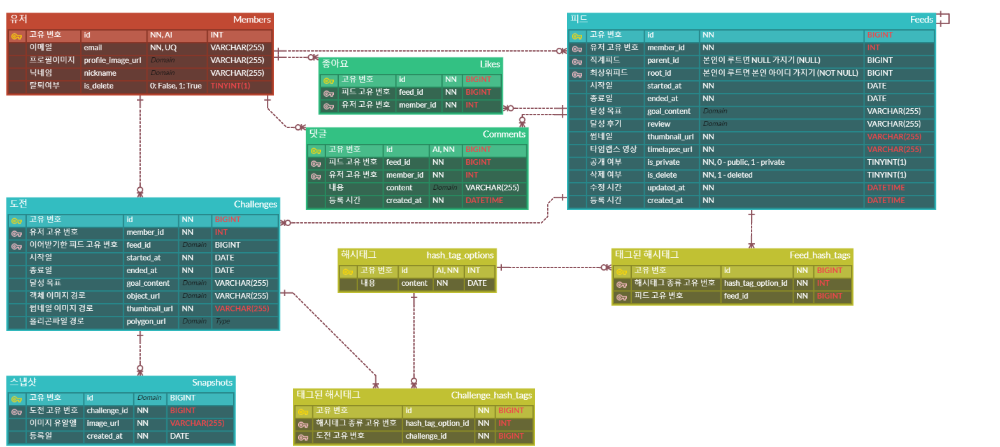

# 🧿 제목 (SSAFY 9기 부울경 E203)

 

  로고   
  <h3>당신의 순간이 습관이 되도록</h3>

## ⌨️ 기간

-   **2023.10.10 ~ 2023.11.17(7주)**

 

## 🔎 목차

1. <a href="#subject">🎯 주제</a>
1. <a href="#mainContents">⭐️ 주요 기능</a>
1. <a href="#systemArchitecture">⚙ 시스템 아키텍쳐</a>
1. <a href="#skills">🛠️ 기술 스택</a>
1. <a href="#erd">💾 ERD</a>
1. <a href="#contents">🖥️ 화면 소개</a>
1. <a href="#developers">👥 팀원 소개</a>

 

<!------- 주제 시작 -------->

## 🎯 주제

### 배경

타임랩스는 일련의 시간에 걸친 변화를 한눈에 보여줍니다. 우리는 이를 통해 누군가의 성장과 변화를 짧은 시간 안에 목격하며, 그들의 여정에서 영감을 얻거나 경외감을 느낍니다.

### 기대효과

습관 형성의 최소 기준인 21일 동안의 사진을 모으면 타입랩스화하여 해당 변화를 미디어 형식으로 조회하고, 이러한 컨텐츠를 공유하고 조회하며 본인의 도전의 동기부여를 받을 수 있습니다.

<a href="#tableContents">목차로 이동</a>

 

<!------- 주요 기능 시작 -------->

## ⭐️ 주요 기능

### SNS

**달성 과정**

-   사용자가 공개 여부를 설정한 것에 따라 자신의 피드에 다른 사람들이 좋아요, 댓글 등을 통해 심리적 보상을 얻음
-   자신이 진행하는 챌린지와 관련 피드들을 보며 성공한 자신의 모습을 상상하며 동기 부여를 얻음
-   각 챌린지의 이어가기 기능을 통해 챌린지 영향력 조회를 통한 성취감, 참여도, 만족도 향상 및 사용자 간의 커뮤니케이션 강화 (회원 간 연결성 부여)

### 영상 처리

**구도 설정**

-   사용자가 비슷한 구도로 사진을 촬영하기 위한 최초 사진 기반 가이드라인 촬영선 제공
-   Challenge에 대한 이미지 첨부시, 최초 사진과의 유사성 검사 및 재촬영 안내를 통해 완성 Mp4파일의 품질 향상
-   Challenge 종료 후 피드 등록시, 첨부된 사진들을 연속시켜 Mp4 파일로 변환

<a href="#tableContents">목차로 이동</a>

 

<!------- 시스템 아키텍쳐 시작 -------->

## ⚙ 시스템 아키텍쳐

아키텍쳐 사진

<a href="#tableContents">목차로 이동</a>

 

<!------- 기술 스택 시작 -------->

## 🛠️ 기술 스택

### 프론트

---

### 백엔드

---

---

---

### 협업

<a href="#tableContents">목차로 이동</a>

 

<!------- ERD 시작 -------->

## 💾 ERD

### ERD

ERD

<a href="#tableContents">목차로 이동</a>

 

<!------- 화면 소개 시작 -------->

 

## 🖥️ 화면 소개

### 카카오 로그인

OAuth로그인을 통한 간편한 계정 연동

### 메인 피드

로그인 유저별 가중치화된 추천 피드 순으로 제공, 챌린지 생성 및 진행 가능

### Challenge 생성 및 진행

Python FastAPI, Detectron을 통한 객체 인식 및 유사도 판별 진행

### 마이페이지

본인의 Feed 공개/비공개 설정

### 피드의 영향력 보기(뿌리보기)

특정 피드의 선한 영향력 정도를 UI를 통해 직관적으로 보기 가능

<a href="#tableContents">목차로 이동</a>

 

### ✔ 프로젝트 결과물

---

<!-- - [포팅메뉴얼] -->

-   [중간발표자료] 발표자료
-   [최종발표자료] 발표자료
<!-- - [최종발표자료] -->

<!------- 팀원 소개 시작 -------->

## 👥 팀원 소개

|  **Name**  |김정희 |정영빈  |하성호 |신현탁 | 이동규 | 김규리 |
| :-----------: | :-----: | :-------: | :------: | :-----: | :------: | :------: |
|  **역할**   |풀스택 | 풀스택| 풀스택 | 프론트엔드 | 풀스택 | 풀스택 |
| **profile** |  |  |  |  |   |    |
|  **전공**   | 컴퓨터공학과, 수학통계학과 |  컴퓨터공학과 |  수산경영학과,컴퓨터공학과     |  기계공학과 |  컴퓨터공학과|  컴퓨터공학과|

<a href="#tableContents">목차로 이동</a>

