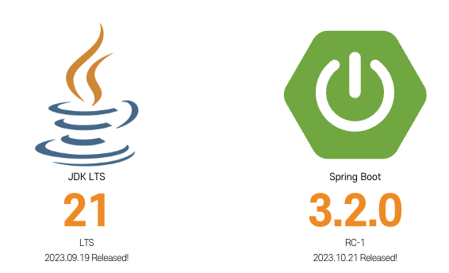
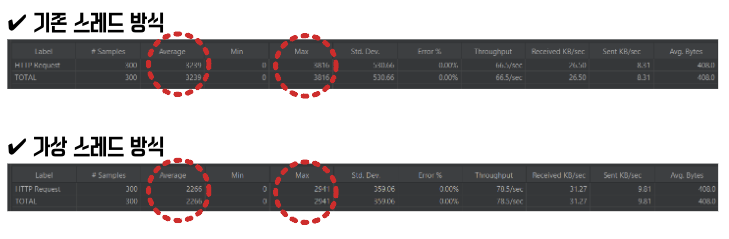
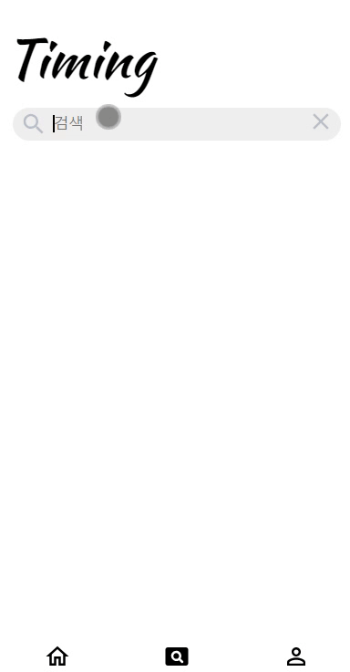
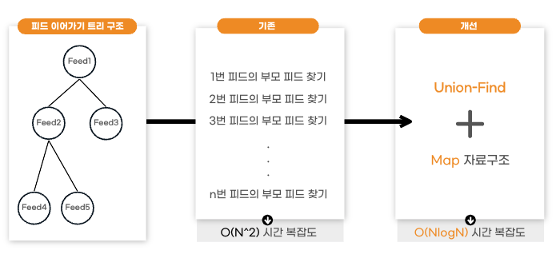

# 🧿 Timing - SpringBoot Backend

<br/>

<div align="center">
     
  <h3>당신의 순간이 습관이 되도록</h3>
</div>


<a name="tableContents"></a>

<br/>

## 🔎 목차

1. <a href="#functions">🚀 특징</a>
1. <a href="#advantages">🌟 기술 특장점</a>
1. <a href="#pipeline">🎞️ CI/CD 파이프라인 구조도</a>
1. <a href="#skills">🛠️ 기술 스택</a>
1. <a href="#directories">🗂️ 파일 구조</a>
1. <a href="#erd">💾 ERD</a>
1. <a href="#swagger">💾 Swagger API docs</a>

<br/>

## 🚀 특징
<a name="functions"></a>
- Java 21, SpringBoot 3.2 기반 프로젝트
- S3 스트림 다운로드 및 MP4 스트리밍 기능
- Spring Security Framework를 활용한 Kakao OAuth 2.0, JWT 인증, 인가 시스템 구현
- 게시글의 Tree 탐색 알고리즘 구현
- Python AI Server 통신을 위한 Proxy API 구현
- JUnit5 & H2 Database 기반 TDD(Test Driven Develop)
- AWS S3, MariaDB, Redis 외부 저장 환경 구축
- SpringDoc 기반 API Docs 구축 (Swagger)
- ELK 기반 Hashtag 검색, 초성 검색 
- 게시글 작성, 공개/비공개, 공유, 이어가기, 연장하기, 댓글 등에 대한 REST API 구현

<div align="right"><a href="#tableContents">목차로 이동</a></div>

<br/>

## 🌟 기술 특장점

<a name="advantages"></a>

### ✔️ Java 21와 가상스레드 적용
---

Java 21 적용을 통하여 I/O Blocking 상황에서 평균 응답속도 1.5배(3239ms → 2255ms) 향상 달성





<br/>

### ✔️ ELK, 초성 검색
---

ELK를 통한 Feed 검색 기능 구현, 초성 검색 지원




### ✔️ Feed(게시글)의 Tree 탐색 알고리즘
---

UnionFind와 Map 자료구조를 통한 탐색 효율 향상



<br/>

### ✔️ 메인 화면의 Feed(게시글) 추천순 제공
---

사용자의 행동 정보(챌린지, 피드, 좋아요, 댓글 이력 등) 기반으로 메인화면 맞춤형 피드 추천순을 제공


<br/>

### ✔️ Python Vision AI 서버와의 통신
---

SpringBoot를 Proxy서버로 이용, 이미지 객체 인식/유사도 판별 요청을 Python서버로 전달


<div align="right"><a href="#tableContents">목차로 이동</a></div>
<br/>

## 🎞️ CI/CD 파이프라인 구조도

<a name="pipeline"></a>


<div align="right"><a href="#tableContents">목차로 이동</a></div>
<br/>


## 🛠️ 기술 스택

<a name="skills"></a><br/>


---


---


<div align="right"><a href="#tableContents">목차로 이동</a></div>
<br/>


## 🗂️ 파일 구조

<a name="directories"></a>

Entity 기준의 폴더 세분화 방식 관리
```
─── src
    ├── main
    │   ├── java
    │   │   └── com
    │   │       └── kkukku
    │   │           └── timing
    │   │               ├── TimingApplication.java
    │   │               ├── apis
    │   │               │   ├── auth
    │   │               │   │   ├── controllers
    │   │               │   │   │   └── AuthController.java
    │   │               │   │   ├── responses
    │   │               │   │   │   └── ReissueResponse.java
    │   │               │   │   └── services
    │   │               │   │       └── AuthService.java
    │   │               │   ├── challenge
    │   │               │   │   ├── controllers
    │   │               │   │   │   └── ChallengeController.java
    │   │               │   │   ├── entities
    │   │               │   │   │   ├── ChallengeEntity.java
    │   │               │   │   │   └── SnapshotEntity.java
    │   │               │   │   ├── repositories
    │   │               │   │   │   ├── ChallengeRepository.java
    │   │               │   │   │   └── SnapshotRepository.java
    │   │               │   │   ├── requests
    │   │               │   │   │   ├── ChallengeCompleteRequest.java
    │   │               │   │   │   ├── ChallengeCreateRequest.java
    │   │               │   │   │   └── ChallengeRelayRequest.java
    │   │               │   │   ├── responses
    │   │               │   │   │   ├── ChallengePolygonResponse.java
    │   │               │   │   │   └── ChallengeResponse.java
    │   │               │   │   └── services
    │   │               │   │       ├── ChallengeService.java
    │   │               │   │       └── SnapshotService.java
    │   │               │   ├── comment
    │   │               │   │   ├── entities
    │   │               │   │   │   └── CommentEntity.java
    │   │               │   │   ├── repositories
    │   │               │   │   │   └── CommentRepository.java
    │   │               │   │   ├── requests
    │   │               │   │   │   └── CommentSaveRequest.java
    │   │               │   │   ├── responses
    │   │               │   │   │   └── CommentResponse.java
    │   │               │   │   └── services
    │   │               │   │       └── CommentService.java
    │   │               │   ├── feed
    │   │               │   │   ├── controllers
    │   │               │   │   │   └── FeedController.java
    │   │               │   │   ├── entities
    │   │               │   │   │   └── FeedEntity.java
    │   │               │   │   ├── repositories
    │   │               │   │   │   └── FeedRepository.java
    │   │               │   │   ├── requests
    │   │               │   │   │   └── FeedUpdateRequest.java
    │   │               │   │   ├── responses
    │   │               │   │   │   ├── FeedDetailResponse.java
    │   │               │   │   │   ├── FeedNodeResponse.java
    │   │               │   │   │   ├── FeedSearchResponse.java
    │   │               │   │   │   ├── FeedSummaryResponse.java
    │   │               │   │   │   └── FeedSummaryWithCountResponse.java
    │   │               │   │   └── services
    │   │               │   │       └── FeedService.java
    │   │               │   ├── hashtag
    │   │               │   │   ├── entities
    │   │               │   │   │   ├── ChallengeHashTagEntity.java
    │   │               │   │   │   ├── FeedHashTagEntity.java
    │   │               │   │   │   └── HashTagOptionEntity.java
    │   │               │   │   ├── repositories
    │   │               │   │   │   ├── ChallengeHashTagRepository.java
    │   │               │   │   │   ├── FeedHashTagRepository.java
    │   │               │   │   │   └── HashTagOptionRepository.java
    │   │               │   │   ├── responses
    │   │               │   │   │   └── FeedHashTagResponse.java
    │   │               │   │   └── services
    │   │               │   │       ├── ChallengeHashTagService.java
    │   │               │   │       ├── FeedHashTagService.java
    │   │               │   │       └── HashTagOptionService.java
    │   │               │   ├── like
    │   │               │   │   ├── entities
    │   │               │   │   │   └── LikeEntity.java
    │   │               │   │   ├── repositories
    │   │               │   │   │   └── LikeRepository.java
    │   │               │   │   └── services
    │   │               │   │       └── LikeService.java
    │   │               │   ├── member
    │   │               │   │   ├── controllers
    │   │               │   │   │   └── MemberController.java
    │   │               │   │   ├── entities
    │   │               │   │   │   └── MemberEntity.java
    │   │               │   │   ├── repositories
    │   │               │   │   │   └── MemberRepository.java
    │   │               │   │   ├── requests
    │   │               │   │   │   └── MemberUpdateRequest.java
    │   │               │   │   ├── responses
    │   │               │   │   │   └── MemberDetailResponse.java
    │   │               │   │   └── services
    │   │               │   │       └── MemberService.java
    │   │               │   └── test
    │   │               │       ├── controllers
    │   │               │       │   ├── SearchTestDto.java
    │   │               │       │   ├── Test.java
    │   │               │       │   ├── TestController.java
    │   │               │       │   ├── TestFeed.java
    │   │               │       │   ├── TestFeedRepository.java
    │   │               │       │   └── TestRepository.java
    │   │               │       ├── requests
    │   │               │       │   └── FeedDummyRequest.java
    │   │               │       └── responses
    │   │               │           ├── FeedResponse.java
    │   │               │           └── MemberResponse.java
    │   │               ├── elasticsearch
    │   │               │   ├── configs
    │   │               │   │   └── ElasticSearchConfig.java
    │   │               │   ├── controllers
    │   │               │   │   └── SearchController.java
    │   │               │   ├── docs
    │   │               │   │   └── HashTagDoc.java
    │   │               │   ├── response
    │   │               │   │   ├── AutoCompleteDto.java
    │   │               │   │   └── HashtagDto.java
    │   │               │   └── service
    │   │               │       └── ElasticSearchService.java
    │   │               ├── exception
    │   │               │   ├── CustomException.java
    │   │               │   └── handler
    │   │               │       └── GlobalExceptionHandler.java
    │   │               ├── external
    │   │               │   └── services
    │   │               │       └── VisionAIService.java
    │   │               ├── jwt
    │   │               │   ├── filters
    │   │               │   │   └── JwtAuthenticationFilter.java
    │   │               │   ├── handlers
    │   │               │   │   ├── JwtAccessDeniedHandler.java
    │   │               │   │   └── JwtAuthenticationEntryPoint.java
    │   │               │   └── services
    │   │               │       └── JwtService.java
    │   │               ├── oauth2
    │   │               │   ├── handlers
    │   │               │   │   ├── OAuth2AuthenticationFailureHandler.java
    │   │               │   │   ├── OAuth2AuthenticationSuccessHandler.java
    │   │               │   │   └── OAuth2LogoutHandler.java
    │   │               │   └── services
    │   │               │       └── OAuth2UserService.java
    │   │               ├── profile
    │   │               │   └── ProfileController.java
    │   │               ├── redis
    │   │               │   ├── configs
    │   │               │   │   └── RedisRepositoryConfig.java
    │   │               │   └── services
    │   │               │       └── RedisService.java
    │   │               ├── response
    │   │               │   ├── ApiResponseUtil.java
    │   │               │   ├── ErrorResponse.java
    │   │               │   └── codes
    │   │               │       └── ErrorCode.java
    │   │               ├── s3
    │   │               │   ├── configs
    │   │               │   │   └── S3Config.java
    │   │               │   └── services
    │   │               │       └── S3Service.java
    │   │               ├── scheduler
    │   │               │   └── CheckChallengeTask.java
    │   │               ├── security
    │   │               │   ├── configs
    │   │               │   │   ├── CorsConfig.java
    │   │               │   │   └── SecurityConfig.java
    │   │               │   ├── entities
    │   │               │   │   └── MemberDetailEntity.java
    │   │               │   ├── services
    │   │               │   │   └── MemberDetailService.java
    │   │               │   └── utils
    │   │               │       └── SecurityUtil.java
    │   │               └── swagger
    │   │                   └── SwaggerConfig.java
    │   └── resources
    │       ├── application.yml
    │       ├── data.sql
    │       └── schema.sql
    └── test
        ├── java
        │   └── com
        │       └── kkukku
        │           └── timing
        │               ├── TimingApplicationTests.java
        │               ├── apis
        │               │   ├── challenge
        │               │   │   └── services
        │               │   │       ├── ChallengeServiceTest.java
        │               │   │       └── SnapshotServiceTest.java
        │               │   ├── comment
        │               │   │   └── services
        │               │   │       └── CommentServiceTest.java
        │               │   ├── feed
        │               │   │   └── services
        │               │   │       └── FeedServiceTest.java
        │               │   ├── hashtag
        │               │   │   └── services
        │               │   │       ├── ChallengeHashTagServiceTest.java
        │               │   │       ├── FeedHashTagServiceTest.java
        │               │   │       └── HashTagOptionServiceTest.java
        │               │   ├── like
        │               │   │   └── services
        │               │   │       └── LikeServiceTest.java
        │               │   └── member
        │               │       └── services
        │               │           └── MemberServiceTest.java
        │               └── scheduler
        │                   └── CheckChallengeTaskTest.java
        └── resources
            ├── application.yml
            ├── image
            ├── mp4
            └── text

```

<div align="right"><a href="#tableContents">목차로 이동</a></div>

<br/>

## 💾 Swagger API docs

<a name="swagger"></a>


<div align="right"><a href="#tableContents">목차로 이동</a></div>
<br/>

