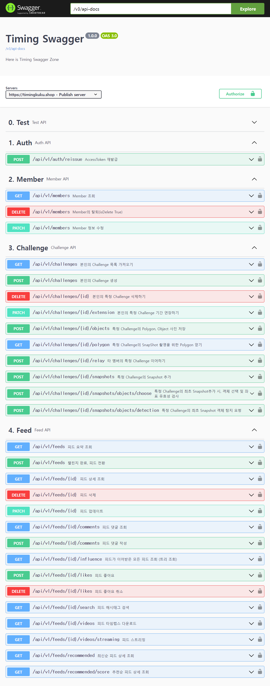

# 🧿 Timing - SpringBoot Backend

 

     
  <h3>당신의 순간이 습관이 되도록</h3>

 

## 🔎 목차

1. <a href="#functions">🚀 특징</a>
1. <a href="#advantages">🌟 기술 특장점</a>
1. <a href="#pipeline">🎞️ CI/CD 파이프라인 구조도</a>
1. <a href="#skills">🛠️ 기술 스택</a>
1. <a href="#directories">🗂️ 파일 구조</a>
1. <a href="#erd">💾 ERD</a>
1. <a href="#swagger">💾 Swagger API docs</a>

 

## 🚀 특징

- Java 21, SpringBoot 3.2 기반 프로젝트
- S3 스트림 다운로드 및 MP4 스트리밍 기능
- Spring Security Framework를 활용한 Kakao OAuth 2.0, JWT 인증, 인가 시스템 구현
- 게시글의 Tree 탐색 알고리즘 구현
- Python AI Server 통신을 위한 Proxy API 구현
- JUnit5 & H2 Database 기반 TDD(Test Driven Develop)
- AWS S3, MariaDB, Redis 외부 저장 환경 구축
- SpringDoc 기반 API Docs 구축 (Swagger)
- ELK 기반 Hashtag 검색, 초성 검색 
- 게시글 작성, 공개/비공개, 공유, 이어가기, 연장하기, 댓글 등에 대한 REST API 구현

<a href="#tableContents">목차로 이동</a>

 

## 🌟 기술 특장점

### ✔️ Java 21와 가상스레드 적용
작성중

### ✔️ ELK, 초성 검색
작성중

### ✔️ Feed(게시글)의 Tree 탐색 알고리즘
작성중

### ✔️ 메인 화면의 Feed(게시글) 추천순 제공
작성중

## 🎞️ CI/CD 파이프라인 구조도

<a href="#tableContents">목차로 이동</a>

 

## 🛠️ 기술 스택

 

---

---

<a href="#tableContents">목차로 이동</a>

 

## 🗂️ 파일 구조

<a href="#tableContents">목차로 이동</a>

 

## 💾 Swagger API docs

<a href="#tableContents">목차로 이동</a>

 

